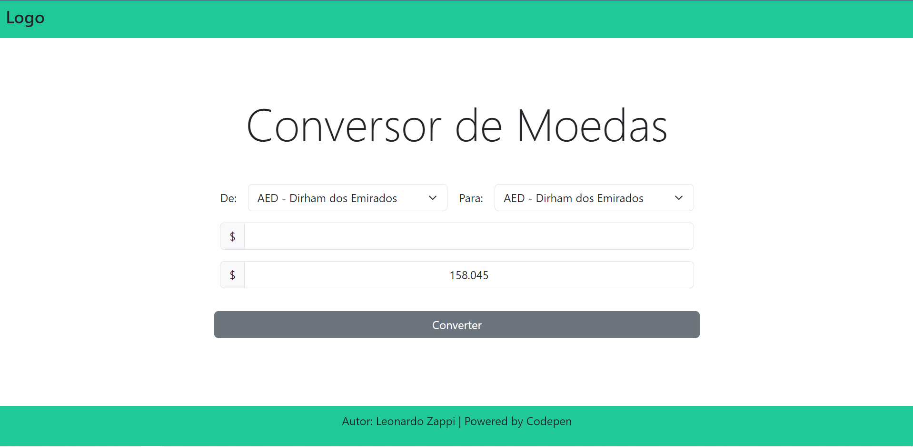

<p align="center">
  <a href="" rel="noopener">
 </a>
</p>

<h3 align="center">Conversor de Moedas</h3>

<div align="center">

[]()
[](https://github.com/LeonardoZappiRamos/6/issues)
[](https://github.com/LeonardoZappiRamos/6/pulls)
[](/LICENSE)

</div>

---

<p align="center"> Um projeto da ImersãoDev 6 em python.
    <br> 
</p>

## 📝 Table of Contents

- [Sobre](#about)
- [Começando](#getting_started)
- [Deployment](#deployment)
- [Modo de uso](#usage)
- [Built Using](#built_using)
- [Authors](#authors)
- [Acknowledgments](#acknowledgement)

## 🧐 Sobre <a name = "about"></a>

Projeto numero 1 da Imersão e basicamente um conversor de moedas, nesse projeto foi construido um conversor utilizando o Flask no back-end e HTML/CSS no front-end.

## 🏁 Começando <a name = "getting_started"></a>

Basta clonar esta repositório e fazer as instalações das dependências. Veja [deployment](#deployment) para como rodar o projeto em produção.

### Prerequisites

Pendências para instalação, lembre sempre de utilizar um ambiente de produção.

```
python -m venv env
```
depois basta instalar as dependências.
```
pip install -r requirements.txt
```

## 🎈 Modo de uso <a name="usage"></a>

Um sistema simples de usa, onde você escolhe a qual a sua moeda e qual a moeda a ser convertida, depois você coloca o valor e acione o botão de conversão.
O resultado ira aparecer abaixo do valor antigo.

## 🚀 Deployment <a name = "deployment"></a>

Esse projeto não foi construido para ser colocado em produção, então segue abaixo como rodar o projeto em desenvolvimento.

Dev Deployment:
```
python -m flask --app app --debug run
```

## ⛏️ Built Using <a name = "built_using"></a>

- [Flask](https://flask.palletsprojects.com/en/2.2.x/) - Serve/Web FrameWork

## ✍️ Authors <a name = "authors"></a>

- [@LeonardoZappiRamos](https://github.com/LeonardoZappiRamos) - Idea & Initial work

See also the list of [contributors](https://github.com/LeonardoZappiRamos/6/contributors) who participated in this project.